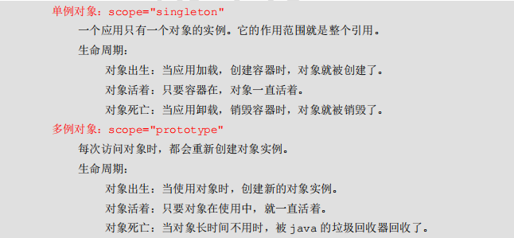
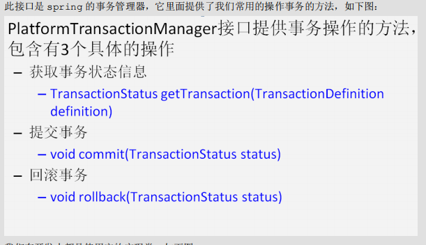
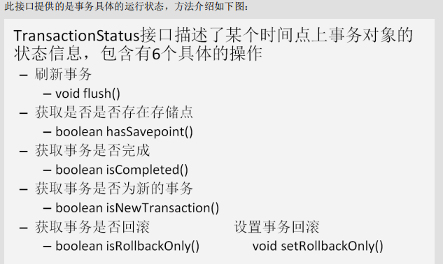
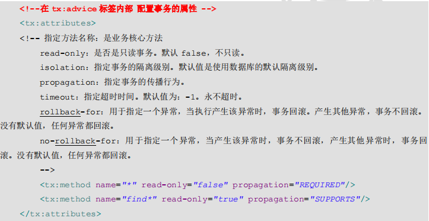

layout:     post
title:      Spring 
subtitle:   
date:       2019-06-23
author:     ctrlcoder
header-img: 
catalog: true
tags:

    - Spring
typora-root-url: ..

## Spring

Spring 是分层的 Java SE/EE 应用 full-stack 轻量级开源框架，以 IoC（Inverse Of Control：反转控制）和 AOP（Aspect Oriented Programming：面向切面编程）为内核，提供了展现层 Spring MVC 和持久层 Spring JDBC 以及业务层事务管理等众多的企业级应用技术，还能整合开源世界众多著名的第三方框架和类库，逐渐成为使用最多的 Java EE 企业应用开源框架。


### IoC（控制反转）

### DI（依赖注入）

## 核心容器（管理Bean的工厂）

### BeanFactory接口

BeanFactory 才是 Spring 容器中的顶层接口，ApplicationContext 是它的子接口。 

**BeanFactory 和 ApplicationContext 的区别：** 

- 创建对象的时间点不一样。 

- ApplicationContext：只要一读取配置文件，默认情况下就会创建对象。 

- BeanFactory：什么使用什么时候创建对象。 

### ApplicationContext接口

- ClassPathXmlApplicationContext 它是从类的根路径下加载配置文件 推荐使用这种

- FileSystemXmlApplicationContext 它是从磁盘路径上加载配置文件，配置文件可以在磁盘的任意位置。

- AnnotationConfigApplicationContext 当我们使用注解配置容器对象时，需要使用此类来创建 spring 容器。它用来读取注解。

  

### 入门程序

1. 创建接口和实现类

2. 配置文件
     		

     ```xml
     	<bean id="userDao" class="com.zen.dao.impl.UserDaoImpl"></bean>
     ```

     

3. 测试程序
     			

     ```java
     ApplicationContext ac = new  		ClassPathXmlApplicationContext("applicationContext.xml");
     UserDao userDao = (UserDao) ac.getBean("userDao")
     ```

     


## Bean

### 常用标签

id：给对象在容器中提供一个唯一标识。用于获取对象。 

class：指定类的全限定类名。用于反射创建对象。默认情况下调用无参构造函数。 

scope：指定对象的作用范围。 

- singleton :默认值，单例的. 

- prototype :多例的. 

-  request :WEB 项目中,Spring 创建一个 Bean 的对象,将对象存入到 request 域中. 

- session :WEB 项目中,Spring 创建一个 Bean 的对象,将对象存入到 session 域中. 

-  global session :WEB 项目中,应用在 Portlet 环境.如果没有 Portlet 环境那么 globalSession 相当于 session. 

init-method：指定类中的初始化方法名称。 

destroy-method：指定类中销毁方法名称。 



### **实例化** **Bean** **的三种方式** 

#### ☆使用默认无参构造函数

#### 静态工厂方法

​	使用 StaticFactory 类中的静态方法 createAccountService 创建对象，并存入 spring 容器

#### 实例工厂方法

​	先把工厂的创建交给 spring 来管理，然后在使用工厂的 bean 来调用里面的方法

### Bean装配（依赖注入）

#### 	基于XML的装配

##### 		构造函数注入

​			涉及的标签：constructor-arg
​			类中需要提供一个对应参数列表的构造函数

##### 		属性setter()方法注入

​			类中提供默认无参构造函数和setter方法
​			涉及的标签：property
​			注入集合类型
​				List 结构的：list,set,array
​				Map 结构的：map,entry|props,prop

#### 基于注解的装配

##### 		常用注解

###### 			用于创建对象的

​				相当于：<bean id="" class="">
​				**@Component**
​					把资源让 spring 来管理。相当于在 xml 中配置一个 bean
​					@Controller @Service @Repository
​				如果不指定 value 属性，默认 bean 的 id 是当前类的类名，首字母小写

###### 			用于注入数据的

​				相当于：<property name="" ref=""> |<property name="" value="">
​				**@Autowired **自动按照类型注入
​				**@Qualifier**
​					在自动按照类型注入的基础之上，再按照 Bean 的 id 注入
​					必须和@Autowire 一起使用；但是给方法参数注入时，可以独立使用
​				**@Resource**
​					直接按照 Bean 的 id 注入
​				**@Value**
​					注入基本数据类型和 String 类型数据的

###### 			用于改变作用范围的

​				相当于：<bean id="" class="" scope="">
​				**@Scope**
​					指定 bean 的作用范围。

##### 注解配置

​			applicationContext.xml

```xml
<!-- 告知 spring 创建容器时要扫描的包 -->
<context:component-scan base-package="com.zen"></context:component-scan>
```

​				告知spring框架在，读取配置文件，创建容器时，扫描注解，依据注解创建对象，并存入容器中

​				告知spring框架在，读取配置文件，创建容器时，扫描注解，依据注解创建对象，并存入容器中

##### 纯注解方法


## AOP

简单的说它就是把我们程序重复的代码抽取出来，在需要执行的时候，使用动态代理的技术，在不修改源码的 

基础上，对我们的已有方法进行增强。

动态代理：字节码随用随创建，随用随加载

### 动态代理常用的有两种方式

**基于接口的动态代理**

提供者：JDK 官方的 Proxy 类。 

要求：被代理类最少实现一个接口。 

**基于子类的动态代理**

提供者：第三方的 CGLib，如果报 asmxxxx 异常，需要导入 asm.jar。 

要求：被代理类不能用 final 修饰的类（最终类）。 

### **Spring** **中的** AOP（AspectJ）

#### 相关术语

**Joinpoint(连接点):** 

所谓连接点是指那些被拦截到的点。在 spring 中,这些点指的是方法,因为 spring 只支持方法类型的 

连接点。 

**Pointcut(切入点):** 

所谓切入点是指我们要对哪些 Joinpoint 进行拦截的定义。

**Advice(通知/增强):** 

所谓通知是指拦截到 Joinpoint 之后所要做的事情就是通知。 

通知的类型：前置通知,后置通知,异常通知,最终通知,环绕通知。 

**Introduction(引介):** 

引介是一种特殊的通知在不修改类代码的前提下, Introduction 可以在运行期为类动态地添加一些方 

法或 Field。 

**Target(目标对象):** 

代理的目标对象。 

**Weaving(织入):** 

是指把增强应用到目标对象来创建新的代理对象的过程。 

spring 采用动态代理织入，而 AspectJ 采用编译期织入和类装载期织入。 

**Proxy（代理）:** 

一个类被 AOP 织入增强后，就产生一个结果代理类。 

**Aspect(切面):** 

是切入点和通知（引介）的结合。 


### 基于 XML 的 AOP 配置

#### 	1. 定义切面类

​	配置
		1. 配置切面类的Bean
		2. aop:config 声明 aop 配置
		3. aop:aspect 配置切面
		4. aop:pointcut 配置切入点表达式
		5. 使用 aop:xxx 配置对应的通知类型

### 基于注解的AOP配置

#### 	配置

​		告知 spring，在创建容器时要扫描的包

```xml
<context:component-scanbase-package="com.zen"></context:component-scan
```

​		开启 spring 对注解 AOP 的支持

```xml
<aop:aspectj-autoproxy/>
```

##### 		不使用 XML 的配置方式


### 	注解

​		@Aspect
​			声明为切面
​		通知类型
​			@Before
​			@AfterReturning
​			@AfterThrowing
​			@After
​			@Around
​			value：用于指定切入点表达式，还可以指定切入点表达式的引用
​		@Pointcut
​			切入点表达式注解

## 事务控制

### 	概述




#### TransactionDefinition


#### 事务的隔离级别


#### 事务的传播行为


**超时时间** 默认值是-1，没有超时限制。如果有，以秒为单位进行设置。

**是否是只读事务**  建议查询时设置为只读。

#### TransactionStatus



### 基于 XML 的声明式事务控制

##### 配置步骤

1 配置事务管理器，依赖数据源

```xml
<bean id="transactionManager"class=*"org.springframework.jdbc.datasource.DataSourceTransactionManager"
   <property name=*"dataSource"* ref=*"dataSource">property> 
</bean> 
```

2 引用事务管理器

```xml
<tx:advice id=*"txAdvice"* transaction-manager=*"transactionManager"> 

</tx:advice>
```

3 配置事务的属性


4 配置 AOP 切入点表达式

```xml
<!-- 配置 aop -->
<aop:config>
<!-- 配置切入点表达式 -->
<aop:pointcut expression="execution(* com.itheima.service.impl.*.*(..))"
id="pt1"/>
</aop:config>
```

5 将切入点与通知整合

```xml
<!-- 在 aop:config 标签内部：建立事务的通知和切入点表达式的关系 -->
<aop:advisor advice-ref="txAdvice" pointcut-ref="pt1"/>
```

#### 基于注解的配置方式

1 配置事务管理器，依赖数据源

2 在业务层使用@Transactional 注解


3 在配置文件中开启 spring 对注解事务的支持

```xml
		<tx:annotation-driven transaction-manager="transactionManager"/>
```

​	纯注解方式


